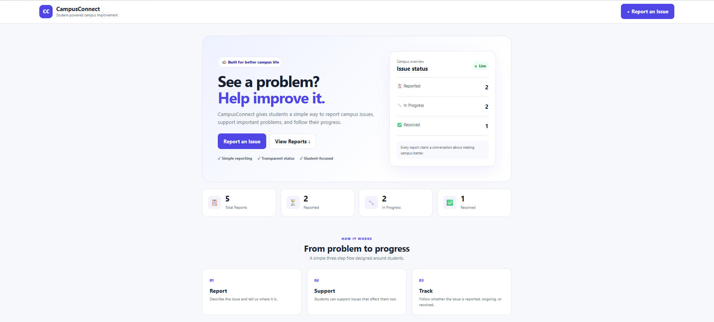
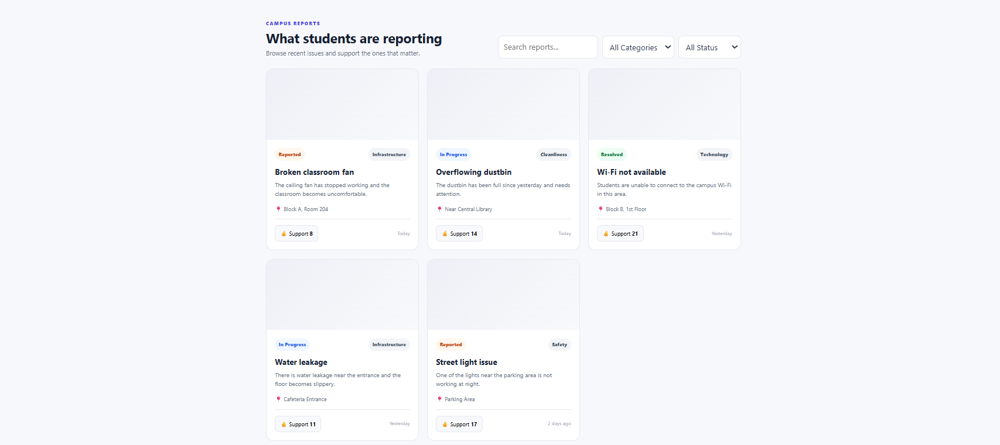
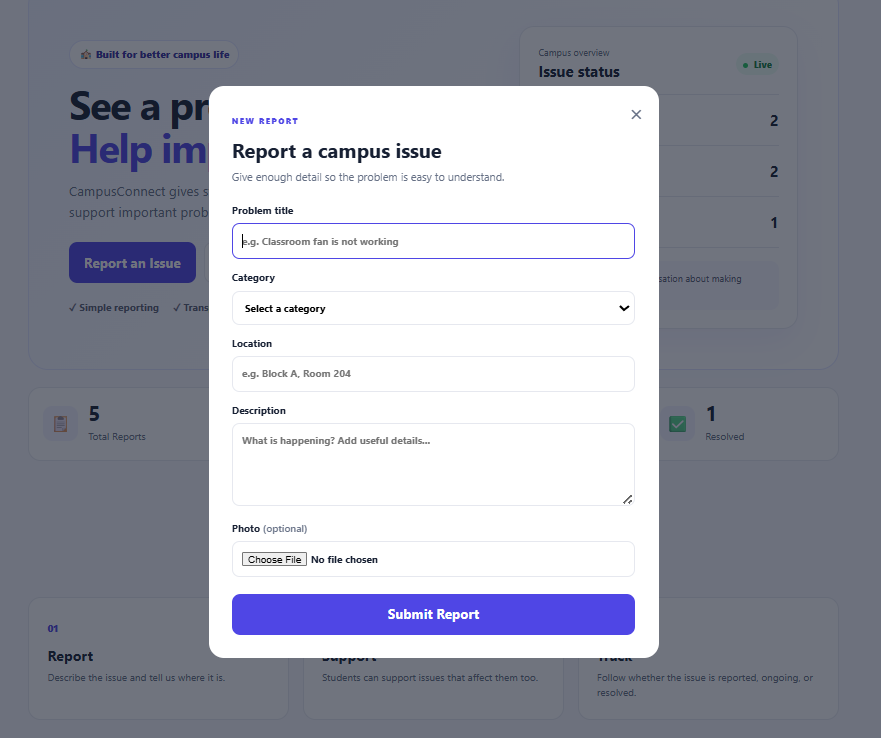

# CampusConnect 

### Hack Devengers 1.0 — Open Innovation Project

CampusConnect is a student-focused web application for reporting and tracking everyday campus problems.

**Tagline:** See a problem? Help improve it.

## Problem
Students notice issues such as broken classroom equipment, cleanliness problems, Wi-Fi failures, water leakage and faulty lights. Reporting can be inconvenient, and students may not know whether an issue has been noticed or resolved.

## Solution
CampusConnect gives students one simple place to:
- Report an issue with title, category, location and description
- Optionally attach a photo
- Browse existing reports
- Search and filter reports
- Support important reports
- View reported, in-progress and resolved issues

## Technology
- HTML5
- CSS3
- JavaScript (ES6)
- Browser localStorage
- FileReader API

## Run locally
1. Open this folder in VS Code.
2. Open `index.html`.
3. Run with Live Server, or open the HTML file directly in a browser.

No package installation is required for this MVP.

## Project structure
```text
CampusConnect/
├── index.html
├── style.css
├── script.js
└── README.md
```

## MVP architecture
User → CampusConnect UI → JavaScript → localStorage

JavaScript handles form submission, DOM updates, search/filtering, support counts and dashboard statistics.

## Future scope
- Node.js + Express backend
- MongoDB/MySQL database
- Student/admin authentication
- Admin dashboard
- Real-time status updates
- Notifications
- Cloud image storage
- Map/location integration
- Role-based access

## Learning outcomes
This project demonstrates practice with responsive UI design, forms, DOM manipulation, JavaScript objects/arrays, events, localStorage, client-side image handling and translating a real-world problem into a working MVP.

**Built for Hack Devengers 1.0.**

## Screenshots

### Home Page


### Issues Reported


### Report Issues

